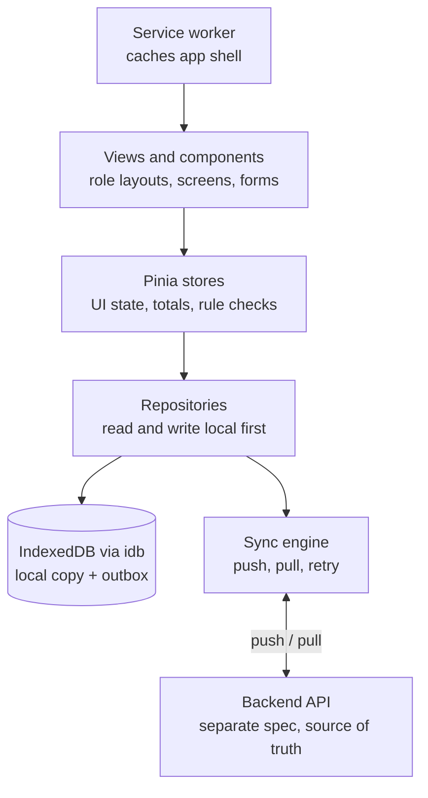

# WRS App — Functional & Frontend Spec

Last updated: 27 Sep 2026

## 1. Overview and scope

One offline-capable web app runs the water refilling station: deliveries, walk-in sales, containers, stock, cash, expenses, payroll and loans. This doc covers the functional spec and the frontend design; the backend gets its own spec, built from section 12.

**Goals**

- Every container, peso and consumable is traceable to a person and a day.
- Riders log a delivery in a few taps, even without signal.
- The owner can run the store from one daily summary.

**In scope:** employees, customers, pricing, containers, deposits, credit, delivery trips, walk-in sales, cashier cash, consumables, maintenance, water quality, expenses, payroll, advances and loans, reports, owner digest.

**Deferred:** shifts, attendance, benefits and government contributions, per-container QR tracking, route planning.

## 2. Roles and permissions

Five roles; one employee can hold several. Only the owner approves, finalizes, or changes settings.

| Area                       | Owner                      | Cashier                  | Rider                 | Washer / Helper      |
| -------------------------- | -------------------------- | ------------------------ | --------------------- | -------------------- |
| Settings and defaults      | Edit                       | —                        | —                     | —                    |
| Employees and pay plans    | Edit                       | —                        | —                     | —                    |
| Customers                  | Edit                       | Create, view             | View name and address | —                    |
| Products and prices        | Edit                       | View                     | View                  | —                    |
| Delivery trips             | All; reconcile             | Load-out, receive return | Own trips only        | —                    |
| Walk-in sales              | All                        | Create                   | —                     | —                    |
| Cash drawer                | View all                   | Own session              | —                     | —                    |
| Credit and payments        | Approve credit, set limits | Collect payments         | Collect on delivery   | —                    |
| Deposits                   | Waive                      | Collect, refund          | Collect on delivery   | —                    |
| Container count            | View, resolve variance     | Daily count              | —                     | —                    |
| Consumables and stock-take | Edit                       | Stock-take, restock      | —                     | —                    |
| Maintenance and water log  | Edit                       | Log readings             | —                     | Log readings         |
| Expenses                   | All                        | Drawer expenses          | —                     | —                    |
| Voids                      | Approve above threshold    | Request                  | Request               | —                    |
| Payroll                    | Run, finalize              | Own payslip              | Own payslip           | Own payslip          |
| Advances and loans         | Approve, release           | Request, own balance     | Request, own balance  | Request, own balance |
| Reports and digest         | All                        | —                        | —                     | —                    |

## 3. Global settings and defaults

Defaults live in one Settings screen; each can be overridden per employee, customer or loan. A change applies from its effective date forward and never rewrites past records.

| Setting                             | Default             | Override at       | Notes                                    |
| ----------------------------------- | ------------------- | ----------------- | ---------------------------------------- |
| Rider daily quota                   | 100 containers      | Employee          | Round containers, reconciled trips only  |
| Incentive per container above quota | TBD (₱)             | Employee          | Paid per day                             |
| Pay frequency                       | TBD                 | Employee          | Daily, weekly, 15/30, monthly            |
| Base rate                           | TBD per role        | Employee          | Riders per day worked; others per period |
| Loan interest rate                  | TBD % per month     | Loan              |                                          |
| Loan interest method                | TBD                 | Loan              | Flat or diminishing                      |
| Max loan amount                     | TBD (₱)             | Employee          |                                          |
| Max loan term                       | TBD months          | Loan              |                                          |
| Deduction cap                       | TBD % of gross      | Employee          | Excess rolls to next pay run             |
| Container deposit                   | TBD (₱) per type    | Customer (waiver) | Round and slim                           |
| Customer credit limit               | TBD (₱)             | Customer          | Blocks credit sales at limit             |
| Void approval threshold             | TBD (₱)             | —                 | Above this, owner approves               |
| Reorder level                       | Per consumable      | Consumable        |                                          |
| Maintenance interval                | Liters and/or days  | Item              | Filters, membrane, UV lamp               |
| TDS acceptable range                | TBD ppm             | —                 | Out-of-range reading alerts owner        |
| Lab test reminder                   | TBD days before due | Test type         |                                          |
| Digest send time                    | End of day          | —                 |                                          |

TBD values are set by the owner at go-live; the app ships with none hard-coded.

## 4. Functional spec by module

Each module below states what it records and what it produces. Rules that cut across modules are numbered in section 5.

### 4.1 Employees

- Name, phone, roles (rider, cashier, washer, helper), active flag.
- Pay plan: frequency, base rate, rate basis (per day or per period), quota and incentive (riders). Inherits defaults; overrides are dated.

### 4.2 Customers

- Name and address only. Address is free text and may hold landmarks.
- Derived, read-only: containers held, deposit on file, credit balance, delivery history.
- Delivery history (owner view): date, rider, delivered, empties collected, amount, payment type.

### 4.3 Products and pricing

- Product: name, type (refill, container, bottled, other), container type (for refills), price, active flag.
- One price per product. A price change is dated; sales keep the price they were sold at.

### 4.4 Containers

- Types: round (delivery and walk-in), slim (walk-in only).
- Pooled counts per type, no per-unit tracking.
- Every movement is logged: purchased, to rider, to customer, collected, returned, damaged, lost, retired.
- Holdings at any time: station, each rider, each customer.
- Daily physical count at the station (full and empty, per type) against expected; variance logged.

### 4.5 Deposits

- Charged per borrowed station container, amount per type from defaults.
- Refunded on return; forfeited on loss or damage.
- Owner can waive per customer.

### 4.6 Credit (utang)

- Owner enables credit per customer and sets the limit (default from settings).
- Credit sales blocked when the sale would exceed the limit; paid in cash instead.
- Payments: full or partial, collected by cashier or rider; they count in that person's cash.
- Aging buckets: current, 7, 15, 30+ days.

### 4.7 Delivery trips

- Load-out: rider, products and quantities (round refills only for containers).
- Deliveries: customer, delivered, empties collected, amount (auto), payment type (cash, e-wallet, credit), deposit collected.
- Return: unsold full, empties, cash, payments collected.
- Reconciliation by cashier or owner: full, empties, cash. Variances become rider shortages.

### 4.8 Walk-in sales

- Product, quantity, customer (required if borrowing, credit or deposit), own or borrowed container, payment type.
- Borrowed containers (round or slim) tracked to the customer.

### 4.9 Cashier cash drawer

- Daily session: opening cash, walk-in cash, collections, drawer expenses, rider remittances, closing count.
- Variance recorded against the cashier.

### 4.10 Consumables

- Item, unit, kind (per-unit, maintenance, general), reorder level.
- Per-unit items (caps, seals) deduct automatically per refill sold, from a per-product usage list.
- Restocks come from expenses; stock-takes adjust counts with a reason.

### 4.11 Maintenance

- Filters, membrane, UV lamp: interval by liters produced and/or days.
- Production meter reading logged; replacement logged with date and meter reading.
- Due and overdue items flagged.

### 4.12 Water quality

- Daily TDS (and pH if measured) with who logged it.
- Lab tests: type, date, result, attached file, next due date.

### 4.13 Expenses

- Category (editable list), amount, date, paid by, source (drawer or owner), receipt photo.
- Consumable purchases also restock inventory.
- Payroll and loan releases post automatically.

### 4.14 Payroll

- Pay runs per frequency and period.
- Riders: base per day worked (days from reconciled trips) plus daily incentive above quota.
- Others: fixed per period plus manual adjustments.
- Deductions: advances, then loan installments, then approved shortages, within the cap.
- Finalize locks the run; corrections go in the next run as adjustments.

### 4.15 Advances and loans

- Request by employee, approved and released by owner, with signed authorization attached.
- Advance: no interest, deducted next run.
- Loan: monthly interest, flat or diminishing, term in months, installments split across pay runs.
- Early payoff waives unearned interest.

### 4.16 Reports and digest

- Reports: rider reconciliation, cashier variance, sales, credit aging, containers held, container count variance, stock and reorder, maintenance due, water quality, expenses, payroll summary, loan balances, monthly profit (sales minus expenses).
- Daily digest to owner: sales (cash and credit), collections, expenses, variances, low stock, maintenance and tests due.

## 5. Business rules

The frontend enforces these for fast feedback; the backend enforces them again as the source of truth.

| #     | Rule                                                                                                                     | Enforced on        |
| ----- | ------------------------------------------------------------------------------------------------------------------------ | ------------------ |
| BR-01 | Slim containers can never be loaded on a trip or delivered.                                                              | Load-out, delivery |
| BR-02 | Recorded sales, deliveries, payments, counts and movements are never edited; fixes are voids or corrections.             | All records        |
| BR-03 | A void needs a reason and records who and when; above the threshold it needs owner approval.                             | Voids              |
| BR-04 | A credit sale is blocked if it takes the customer over their limit.                                                      | Delivery, walk-in  |
| BR-05 | Credit sales require the customer to be credit-enabled by the owner.                                                     | Delivery, walk-in  |
| BR-06 | Borrowing a station container requires a customer and a deposit, unless waived.                                          | Delivery, walk-in  |
| BR-07 | Deliveries are only allowed on the rider's own open trip.                                                                | Delivery           |
| BR-08 | A trip is reconciled only after all its offline entries have synced.                                                     | Reconciliation     |
| BR-09 | Reconciliation: loaded = delivered + returned full; empties collected = empties returned; cash expected = cash remitted. | Reconciliation     |
| BR-10 | Incentive counts only round containers on reconciled trips: (delivered that day − quota) × rate, floored at 0.           | Payroll            |
| BR-11 | Deductions stop at the cap; the remainder rolls to the next run.                                                         | Payroll            |
| BR-12 | Deduction order: advances, loan installments, approved shortages.                                                        | Payroll            |
| BR-13 | Shortages are recorded, never deducted unless the owner approves each one.                                               | Payroll            |
| BR-14 | A finalized pay run is read-only.                                                                                        | Payroll            |
| BR-15 | A loan is released only with a signed authorization attached.                                                            | Loans              |
| BR-16 | Early loan payoff waives interest not yet earned.                                                                        | Loans              |
| BR-17 | Price and default changes apply from their effective date; history is kept.                                              | Settings, pricing  |
| BR-18 | Selling a refill deducts its consumables from stock.                                                                     | Sales              |
| BR-19 | A consumable purchase expense restocks that consumable.                                                                  | Expenses           |
| BR-20 | Only the owner changes settings, pay plans, credit limits, deposit waivers, or finalizes payroll.                        | All                |

## 6. Frontend stack and architecture

Recommended stack: Vue 3 + TypeScript, local-first. Swap any row before building the skeleton.

| Concern              | Choice                                                          |
| -------------------- | --------------------------------------------------------------- |
| Framework            | Vue 3, Composition API, `<script setup>`, TypeScript            |
| Build                | Vite                                                            |
| Styling              | Tailwind CSS only; all components built in-house, no UI library |
| State                | Pinia                                                           |
| Routing              | Vue Router with role guards                                     |
| Offline storage      | idb (IndexedDB)                                                 |
| PWA                  | vite-plugin-pwa (Workbox)                                       |
| Forms and validation | VeeValidate + Zod                                               |
| Dates                | date-fns, fixed to Asia/Manila                                  |
| Money                | Integer centavos everywhere; format only at display             |
| Charts               | Chart.js (reports only)                                         |
| Labels               | vue-i18n, English and Filipino                                  |
| Photos               | Camera file input, compressed on device before upload           |
| Testing              | Vitest (units), Playwright (flows)                              |



Screens never call the network directly. Every read and write goes to the local database; the sync engine moves changes to and from the backend in the background.

## 7. Project structure

Feature folders: each module owns its views, components, store and repository. Shared code lives in `core`.

```text
src/
  app/
    main.ts
    App.vue
    router/            # routes, role guards
    layouts/           # OwnerLayout, CashierLayout, RiderLayout, StaffLayout, AuthLayout
  core/
    db/                # idb schema, versions, outbox table
    sync/              # sync engine, status store, conflict handling
    api/               # HTTP client (used only by sync)
    auth/              # session, current user, roles
    rules/             # business rules BR-01..BR-20 as pure functions
    money/             # centavos helpers, formatting
    dates/             # Asia/Manila helpers
    i18n/              # en, fil
    ui/                # base components, Tailwind only (Button, Field, Sheet, Dialog, Stepper, NumberPad, EmptyState, SyncBadge)
  features/
    settings/
    employees/
    customers/
    products/
    containers/        # holdings, movements, daily count
    deposits/
    credit/
    trips/             # load-out, deliveries, return, reconciliation
    walkin/
    cashier/           # drawer session
    consumables/
    maintenance/
    water-quality/
    expenses/
    payroll/
    loans/
    voids/
    reports/
    dashboard/         # owner home + daily digest
  types/               # entity types (mirror of section 12)
```

Each feature folder follows the same shape:

```text
features/trips/
  views/        # routed pages
  components/   # feature-only parts
  store.ts      # Pinia store
  repo.ts       # local-first reads/writes + outbox
  schema.ts     # Zod form schemas
  routes.ts     # feature routes, merged into router
```

## 8. Routing and navigation

After login, the user lands on their role's home. A user with several roles picks one from a role switcher; the route guard checks the active role on every navigation.

**Navigation pattern:** bottom tab bar (max 5 tabs) on phones for rider, cashier and staff; side nav on tablet and desktop for owner.

| Role            | Home                    | Tabs / nav                                                                                  |
| --------------- | ----------------------- | ------------------------------------------------------------------------------------------- |
| Rider           | `/rider` (today's trip) | Trip, Customers, Me                                                                         |
| Cashier         | `/cashier` (drawer)     | Sell, Trips, Count, Stock, Me                                                               |
| Washer / Helper | `/staff`                | Logs, Me                                                                                    |
| Owner           | `/owner` (dashboard)    | Dashboard, Sales, Trips, Customers, Containers, Inventory, Money, People, Reports, Settings |

**Route map**

| Path                                   | Screen                                                    | Roles                   |
| -------------------------------------- | --------------------------------------------------------- | ----------------------- |
| `/login`                               | Login                                                     | All                     |
| `/rider`                               | Today's trip                                              | Rider                   |
| `/rider/trip/:id/deliver/:customerId?` | Log delivery                                              | Rider                   |
| `/rider/trip/:id/return`               | Return summary                                            | Rider                   |
| `/rider/customers`                     | Customer list (name, address)                             | Rider                   |
| `/cashier`                             | Drawer session                                            | Cashier                 |
| `/cashier/sell`                        | Walk-in sale                                              | Cashier                 |
| `/cashier/trips`                       | Load-out and receive return                               | Cashier                 |
| `/cashier/trips/:id/reconcile`         | Reconcile trip                                            | Cashier, Owner          |
| `/cashier/count`                       | Daily container count                                     | Cashier                 |
| `/cashier/stock`                       | Restock and stock-take                                    | Cashier                 |
| `/staff/logs`                          | TDS and meter readings                                    | Washer, Helper, Cashier |
| `/me`                                  | Payslips, loans, advance request                          | All employees           |
| `/owner`                               | Dashboard and digest                                      | Owner                   |
| `/owner/sales`                         | Sales list, voids                                         | Owner                   |
| `/owner/trips`                         | All trips, reconciliation                                 | Owner                   |
| `/owner/customers`, `/:id`             | Customers, detail with history, credit, deposits          | Owner                   |
| `/owner/containers`                    | Holdings, movements, count variances                      | Owner                   |
| `/owner/inventory`                     | Products, prices, consumables, maintenance, water quality | Owner                   |
| `/owner/money`                         | Credit aging, expenses, cash sessions                     | Owner                   |
| `/owner/people`                        | Employees, pay plans, payroll runs, loans                 | Owner                   |
| `/owner/approvals`                     | Voids, loans, credit, waivers pending                     | Owner                   |
| `/owner/reports/:report`               | Reports                                                   | Owner                   |
| `/owner/settings`                      | Global defaults                                           | Owner                   |

## 9. Screen inventory

40 screens, login included, across four role areas. Each lists what it shows and its main actions; build them as empty shells first (section 14).

### Rider

| Screen          | Shows                                                                | Actions                                                |
| --------------- | -------------------------------------------------------------------- | ------------------------------------------------------ |
| Today's trip    | Loaded, delivered, left; sync status; customer list                  | Start delivery, end trip                               |
| Log delivery    | Customer name and address; delivered and empties (prefilled); amount | Pay cash / e-wallet / credit, collect deposit, confirm |
| Collect payment | Customer credit balance                                              | Record partial or full payment                         |
| Return summary  | Expected full, empties, cash                                         | Submit return                                          |
| Customers       | Name and address, search                                             | Open delivery for customer                             |

### Cashier

| Screen           | Shows                                                 | Actions                                                           |
| ---------------- | ----------------------------------------------------- | ----------------------------------------------------------------- |
| Drawer session   | Opening cash, running totals by source                | Open, drawer expense, close with count                            |
| Walk-in sale     | Product grid, qty, container (own or borrowed), total | Pay cash / e-wallet / credit, deposit, customer pick or quick-add |
| Collect payment  | Customer search, balance, aging                       | Record payment                                                    |
| Return container | Customer holdings                                     | Record return, refund deposit                                     |
| Trips            | Open trips by rider                                   | New load-out, receive return                                      |
| Load-out         | Rider, products and quantities                        | Confirm load-out                                                  |
| Receive return   | Full, empties, cash entry vs expected                 | Submit                                                            |
| Reconcile trip   | Variance per line                                     | Reconcile, record shortage                                        |
| Daily count      | Round and slim, full and empty, expected vs counted   | Submit count                                                      |
| Stock            | Consumables on hand, reorder flags                    | Restock, stock-take                                               |
| Readings         | TDS, pH, production meter                             | Log reading                                                       |
| Void request     | Record summary                                        | Submit with reason                                                |

### All employees

| Screen  | Shows                                         | Actions                 |
| ------- | --------------------------------------------- | ----------------------- |
| Me      | Payslips, loan and advance balances           | Request advance or loan |
| Payslip | Base, incentive, adjustments, deductions, net | —                       |

### Owner

| Screen              | Shows                                                  | Actions                                 |
| ------------------- | ------------------------------------------------------ | --------------------------------------- |
| Dashboard           | Today: sales, collections, expenses, variances, alerts | Open any alert                          |
| Daily digest        | End-of-day summary, past days                          | —                                       |
| Approvals           | Pending voids, loans, credit, waivers                  | Approve, reject                         |
| Sales               | All sales and deliveries, filters                      | Void                                    |
| Trips               | All trips, status, variances                           | Reconcile, view                         |
| Customers           | List with holdings and balances                        | Add, edit                               |
| Customer detail     | Holdings, deposit, credit, delivery history            | Enable credit, set limit, waive deposit |
| Containers          | Holdings by location; movement log; count variances    | Mark damaged, lost, purchased           |
| Products and prices | Products, current price, price history                 | Add, change price                       |
| Consumables         | Stock, usage per product, reorder levels               | Edit usage list, stock-take             |
| Maintenance         | Items, due and overdue                                 | Log replacement                         |
| Water quality       | TDS trend, lab tests, next due                         | Add lab test with file                  |
| Expenses            | By category and month                                  | Add with receipt                        |
| Credit aging        | Customers by aging bucket                              | Open customer                           |
| Cash sessions       | Drawer sessions and variances                          | View                                    |
| Employees           | List, roles                                            | Add, edit, pay plan                     |
| Payroll runs        | Runs by period and status                              | New run, adjust, finalize               |
| Loans               | All loans and advances                                 | Approve, release with authorization     |
| Reports             | Report list, filters, export                           | Export CSV                              |
| Settings            | Global defaults (section 3)                            | Edit with effective date                |

Washer and helper use Readings and Me only.

## 10. Key flows

Each flow lists the steps, the rules checked (section 5), and what is written locally.

### 10.1 Delivery trip

1. Cashier creates load-out: rider, round refills and quantities (BR-01). Writes trip + container movement station → rider.
2. Rider syncs, opens Today's trip.
3. Per stop: tap customer → delivered and empties prefilled from last delivery → adjust → payment type.
   - Credit: blocked if over limit or not enabled (BR-04, BR-05); rider switches to cash.
   - Borrowed container without deposit on file: prompt deposit unless waived (BR-06).
4. Confirm. Writes delivery + movements (rider → customer, customer → rider) + outbox entry. Works offline.
5. Rider taps End trip → Return summary shows expected full, empties and cash.
6. Cashier receives return: enters counted full, empties, cash.
7. Reconcile once fully synced (BR-08). Variances (BR-09) create a shortage record for owner review (BR-13).

### 10.2 Walk-in sale

1. Pick product(s) and quantity.
2. Container: own or borrowed. Borrowed requires a customer (search or quick-add) and deposit (BR-06).
3. Payment: cash, e-wallet or credit (BR-04, BR-05).
4. Confirm. Writes sale, movements, consumable deductions (BR-18), drawer entry.

### 10.3 Cashier day

1. Open drawer with opening cash.
2. Sales, collections, rider remittances and drawer expenses post to the session automatically.
3. End of day: daily container count (expected vs counted), then close drawer with cash count.
4. Variances saved against the cashier; both feed the owner digest.

### 10.4 Payroll run

1. Owner creates run: frequency and period.
2. App computes per employee: base (riders: days from reconciled trips), daily incentive (BR-10), adjustments.
3. Deductions applied in order within the cap (BR-11, BR-12); overflow shown as carried over.
4. Owner reviews, adds adjustments, finalizes (BR-14). Payslips appear under Me. Payroll expense posts.

### 10.5 Advance or loan

1. Employee requests amount (and term for loans) from Me.
2. Owner sees request in Approvals with a preview: interest, installment per pay run, schedule.
3. Owner attaches signed authorization (photo) and releases (BR-15). Release posts as expense.
4. Installments deduct in each payroll run; early payoff recalculates interest (BR-16).

### 10.6 Void or correction

1. From any record: Request void → reason required (BR-03).
2. At or under threshold: applied, logged. Above: goes to Approvals.
3. Approved void writes reversing entries; the original stays visible, marked void.

### 10.7 Credit payment

1. Rider (on delivery) or cashier opens customer → sees balance and aging.
2. Enter amount (partial allowed) → confirm. Payment counts in that person's cash.

## 11. Offline and sync

All roles work offline; riders depend on it. Records are append-only (BR-02), so sync is mostly pushing new entries, with few true conflicts.

**Local data**

- IndexedDB holds the records each role needs: rider gets own trips, customers, products, prices, credit balances; cashier and owner get everything for the store.
- Every record gets a client-generated UUID and `createdAt` at write time, so offline entries are valid before sync.
- `outbox` table: one row per write (entity, payload, attempts, last error).

**Sync engine**

- Push: send outbox in creation order; remove each row on server acknowledgement. Retry with backoff on failure.
- Pull: fetch changes since the last cursor per table; upsert locally.
- Triggers: app start, network regained, every few minutes while online, and a manual Sync now button.
- Before a trip starts, the rider app forces a sync so credit balances and prices are fresh.

**Conflicts**

- Server wins on reference data (prices, settings, credit limits).
- A pushed record the server rejects (e.g. credit over limit because of a sale elsewhere) is kept, marked **Rejected** with the reason, and shown in the owner's Approvals and at reconciliation.
- Records are never silently dropped.

**What the user sees**

| State      | Indicator                                  |
| ---------- | ------------------------------------------ |
| All synced | Green dot, last sync time                  |
| Pending    | Amber badge with count of unsynced entries |
| Offline    | Grey badge "Offline — saved on this phone" |
| Rejected   | Red badge; tap for details                 |

**Guards**

- Trip reconciliation disabled while that trip has unsynced entries (BR-08).
- Payroll runs, approvals and settings require online; screens say so instead of failing.
- Logout blocked while the outbox is not empty, to prevent data loss.

**PWA**

- Installable, app shell cached, updates prompt to reload once the outbox is empty.

## 12. Frontend data contract

The entities and actions the frontend expects. This is the input for the backend spec, not the database design. All ids are UUIDs; money is integer centavos; times are ISO timestamps.

**Entities**

| Entity            | Key fields                                                                                                                |
| ----------------- | ------------------------------------------------------------------------------------------------------------------------- |
| Setting           | key, value, effectiveFrom                                                                                                 |
| Employee          | id, name, phone, roles[], active                                                                                          |
| PayPlan           | employeeId, frequency, rateBasis, baseRate, quota?, incentivePerContainer?, deductionCapPct?, effectiveFrom, effectiveTo? |
| Customer          | id, name, address, creditEnabled, creditLimit?, depositWaived                                                             |
| Product           | id, name, kind, containerType?, active                                                                                    |
| Price             | productId, amount, effectiveFrom                                                                                          |
| ContainerType     | code (round, slim), deliverable, depositAmount                                                                            |
| ContainerMovement | id, type, qty, full, from, to, riderId?, customerId?, reason, refType, refId                                              |
| Trip              | id, riderId, status (open, returned, reconciled), loadedAt, returnedAt?, cashRemitted?                                    |
| TripLine          | tripId, productId, loaded, returnedFull, returnedEmpty                                                                    |
| Delivery          | id, tripId, customerId, productId, delivered, emptiesCollected, amount, paymentType, depositCollected                     |
| WalkInSale        | id, customerId?, lines[], borrowed, returned, amount, paymentType, depositCollected                                       |
| Payment           | id, customerId, amount, collectedBy, source (trip or drawer)                                                              |
| DepositEntry      | id, customerId, containerType, amount, kind (collected, refunded, forfeited)                                              |
| DrawerSession     | id, cashierId, openedAt, openingCash, closedAt?, countedCash?                                                             |
| ContainerCount    | id, date, type, full, empty, expected                                                                                     |
| Shortage          | id, employeeId, source (trip, drawer), cash, containers, approvedForDeduction                                             |
| Consumable        | id, name, unit, kind, reorderLevel, intervalLiters?, intervalDays?                                                        |
| ProductUsage      | productId, consumableId, qtyPerUnit                                                                                       |
| StockEntry        | id, consumableId, qty (+/-), reason, refId?                                                                               |
| MeterReading      | id, liters, at                                                                                                            |
| MaintenanceLog    | id, consumableId, at, meterLiters                                                                                         |
| WaterReading      | id, tds, ph?, at, by                                                                                                      |
| LabTest           | id, type, date, result, fileUrl, nextDue                                                                                  |
| Expense           | id, category, amount, date, paidBy, source (drawer, owner), receiptUrl?, consumableId?, qty?                              |
| PayRun            | id, frequency, periodStart, periodEnd, status                                                                             |
| PayLine           | runId, employeeId, daysWorked, delivered, base, incentive, adjustments, deductions[], net                                 |
| Loan              | id, employeeId, type (advance, loan), principal, ratePct, method, termMonths, authorizationUrl?, status                   |
| Installment       | loanId, seq, due, principalPart, interestPart, paid                                                                       |
| Void              | id, refType, refId, reason, requestedBy, status, approvedBy?                                                              |

**Actions** (each maps to one backend endpoint; offline-capable ones go through the outbox)

| Action                                                           | Offline                   |
| ---------------------------------------------------------------- | ------------------------- |
| createTrip, recordDelivery, recordPayment, endTrip               | Yes                       |
| receiveReturn, reconcileTrip                                     | Receive yes; reconcile no |
| recordWalkInSale, returnContainer                                | Yes                       |
| openDrawer, closeDrawer, recordDrawerExpense                     | Yes                       |
| submitContainerCount, recordStockEntry, logReading, logMeter     | Yes                       |
| requestVoid, requestLoan                                         | Yes                       |
| approve / reject (voids, loans, credit, waivers)                 | No                        |
| createPayRun, adjustPayLine, finalizePayRun                      | No                        |
| releaseLoan                                                      | No                        |
| updateSettings, updatePrice, updatePayPlan, updateCustomerCredit | No                        |
| pullChanges(since)                                               | —                         |

Computed by the backend (frontend shows, never stores as truth): holdings, balances, aging, expected counts, reconciliation variances, pay lines, loan schedules.

## 13. UI and design guidelines

Design for a rider on a cheap Android phone, in sun, with one hand. Everything else scales up from there.

**Layout**

- Mobile-first; owner screens add a side nav and wider tables at 1024 px and up.
- One primary action per screen, fixed at the bottom within thumb reach.
- Forms in bottom sheets for quick entries; full pages only for long forms.

**Touch and input**

- Tap targets at least 48 px; steppers (− / +) and a number pad for quantities, never a tiny text field.
- Prefill wherever history allows (last delivered, last empties).
- Confirm step shows totals in large type before saving.

**Speed**

- Target: a delivery logged in 5 taps or fewer.
- Lists virtualized; customer search works on local data, instant.
- Initial JS bundle kept small (route-level code splitting); test on a low-end Android device.

**Visual**

- High contrast for outdoor use; body text 16 px minimum, totals 24 px+.
- Status colours only with meaning: green synced / OK, amber pending / due soon, red rejected / variance / overdue. Always paired with text or an icon.
- Light and dark theme via Tailwind tokens.
- Money as ₱1,234.00; dates as 27 Sep 2026; times in Asia/Manila.

**Feedback**

- Every save confirms with a toast that says saved locally or synced.
- Blocked actions explain why in one line (e.g. "Credit limit reached — take cash").
- Empty states say what to do next.

**Language**

- English and Filipino labels via vue-i18n; plain words, no accounting jargon on staff screens.

**Accessibility**

- Labels on every input, visible focus, screen-reader names on icon buttons.

## 14. Skeleton build checklist

The skeleton is done when every route renders its shell for the right role, running on mock local data, with no backend.

**Foundation**

- [ ] Vite + Vue 3 + TypeScript + Tailwind + Pinia + Vue Router scaffold
- [ ] Folder structure per section 7
- [ ] vite-plugin-pwa installed; app installs and loads offline
- [ ] vue-i18n with `en` and `fil` files, keys only
- [ ] Money and date helpers (centavos, Asia/Manila)

**App shell**

- [ ] Layouts: Owner (side nav), Cashier, Rider, Staff (bottom tabs), Auth
- [ ] Mock login with role picker; role switcher for multi-role users
- [ ] Route guards by role; redirect to role home
- [ ] All routes from section 8 registered, each rendering a titled placeholder

**Core UI kit**

- [ ] Button, Field, Select, Stepper, NumberPad, BottomSheet, Dialog, Toast, EmptyState, DataTable, SyncBadge, MoneyText

**Data layer stubs**

- [ ] idb schema for section 12 entities + outbox table
- [ ] Seed script with mock employees, customers, products, prices, containers
- [ ] One repository per feature with typed read/write stubs
- [ ] Sync engine stub: status store and SyncBadge wired, push/pull as no-ops
- [ ] Business rules BR-01 to BR-20 as pure function signatures with unit test placeholders

**First screens to flesh out** (proves the pattern end to end)

- [ ] Rider: Today's trip → Log delivery → Return summary, fully offline on mock data
- [ ] Cashier: Walk-in sale with borrowed container and deposit prompt
- [ ] Owner: Settings screen for global defaults

**Open items before implementation**

- Default values marked TBD in section 3.
- Payment types: confirm cash, e-wallet and credit are the full list.
